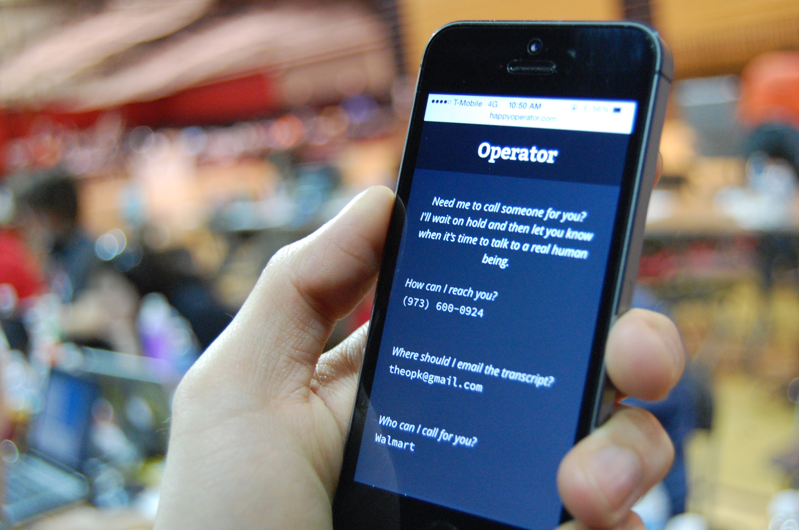

# [Operator](http://happyoperator.com)

_"Hello! Who would you like to call?"_ I let you know when a real human is ready to take your call.

## Purpose

1. Automate phone menu systems.
2. Never wait on hold.
3. Get an email with a transcript and recording of your call.

## Authors

By [Theo Pak](http://github.com/theopak) and [Derek Schultz](http://github.com/derek-schultz) at [HackRU Spring 2014](http://hackRU.org).
